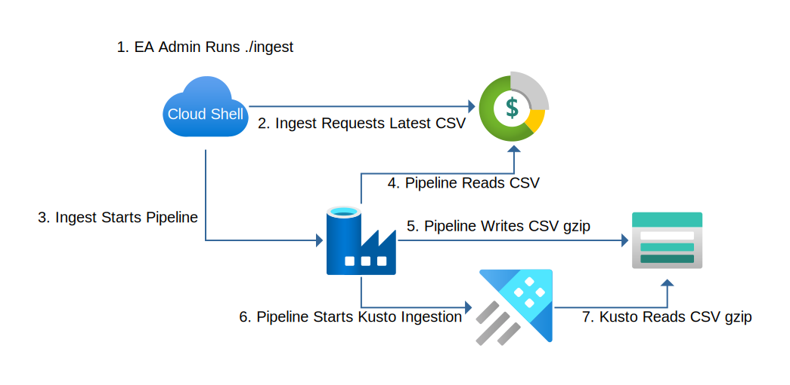
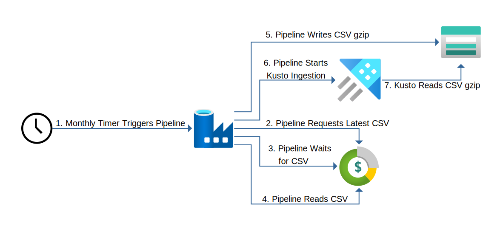

# azure-usage-pipeline

This project creates an environment for automatically ingesting Azure usage data in to an Azure Data Explorer cluster. This is useful in large accounts with millions of usage records that need to be explored and/or processed. It is also useful for any size account where custom processing is required for cost allocation and allotment beyond what is possible in the Cost Management portal with tags and scopes.

The pipeline has 2 modes. The first is for the "legacy" Enterprise Agreement [account type](https://docs.microsoft.com/en-us/azure/cost-management-billing/cost-management-billing-overview#billing-accounts). The second is for the new Microsoft Customer Agreement account type. Both modes make use of the [Usage Details API](https://docs.microsoft.com/en-us/azure/cost-management-billing/manage/consumption-api-overview#usage-details-api) to retrieve "version 2" amortized cost usage records.

The pipeline compresses and stores the Usage Detail CSV data in to a storage account for archival purposes and loads it to Azure Data Explorer for online analysis.

# Enterprise Agreement

EA billing accounts use the EA Portal to [assign roles](https://docs.microsoft.com/en-us/azure/cost-management-billing/manage/ea-portal-get-started#enterprise-user-roles). Because these roles can not be assigned to service principal (application identity), an EA admin user must call the usage details API. This process has been greatly simplified so that the administrator needs to run just 1 command in the Azure Cloud Shell to ingest the last month's usage on an ongoing basis.



## Deploy the Environment

This process requires an Azure subscription, resource group, and service principal in the same Azure tenant as the users with access to the billing account. 

[Deploy](https://portal.azure.com/#create/Microsoft.Template/uri/https%3A%2F%2Fraw.githubusercontent.com%2Fwpbrown%2Fazure-usage-pipeline%2Fmaster%2Fazuredeploy.json) `azuredeploy.json` using the Azure Portal, Azure CLI, or PowerShell.

## Configure the Database

Connect to your new Kusto cluster using the [Azure Data Explorer Web UI](https://dataexplorer.azure.com/), Kusto Explorer, or the Kusto CLI. Run all of the commands in `usage.csl`. If you are using the Web UI you must highlight each command by clicking anywhere in them and run them one by one.

## Ingestion

This process requires an account that has:

 * Reader or higher access to the subscription containing the Data Factory
 * Data Factory Contributor, a custom role that allows the user to start the pipeline, or higher access to the Data Factory
 * Enterprise Admin rights (read-only is sufficient) in the EA portal

While the instructions below are for the Azure Cloud Shell, this package can be used in any Linux environment with Python >=3.5, virtualenv, and the Azure CLI installed. If not using the Cloud Shell, you must be logged in to the Azure CLI with an account that meets the requirements above.

### First-time Setup

Open a [Bash session](https://docs.microsoft.com/en-us/azure/cloud-shell/quickstart) in the [Azure Cloud Shell](https://docs.microsoft.com/en-us/azure/cloud-shell/overview).

```shell
will@Azure:~$ wget https://github.com/wpbrown/azure-usage-pipeline/releases/latest/download/ingest.tar.gz
will@Azure:~$ tar xf ingest.tar.gz
will@Azure:~$ cd ingest
will@Azure:~/ingest$ code ingest.ini
```

A text editor will open. Fill in the subscription, resource group, and data factory name using the outputs from the ARM template deployment. You can view the deployment on the resource group in the Portal at anytime to see the outputs. Use your EA account number for the billing account name. Press Ctrl-Q to close the editor and choose "Save" when prompted to save your changes.

The first time the `./ingest` command is run you will see a lot of output as the Python virtual environment is loaded. After the initial setup you will see `First time setup complete.`. Subsequent use of the command will start immediately as shown below. All setup is local to the `ingest` directory. To uninstall this package, simply delete the `ingest` directory.

### Start an Ingestion

To start an ingestion simply run the `./ingest` command from the `ingest` directory.  followed by output like below.

```shell
will@Azure:~/ingest$ ./ingest
Selecting billing period...
Selected billing period: 202001 (2020-01-01 - 2020-01-31)
Generating usage data (this can take 5 to 10 minutes)...
Generate data status: InProgress
Generate data status: InProgress
Generate data status: InProgress
Generate data status: InProgress
Generate data status: Completed
Got URL to blob: https://ccmreportstoragepilot.blob.core.windows.net/armreports/20200213/00112233-4455-6677-8899-aabbccddeeff?sv=2016-05-31...
Starting Data Factory Ingestion Pipeline...
Created Ingestion Pipeline Run: 00112233-4455-6677-8899-aabbccddeeff
Monitoring Pipeline...
Pipeline status: InProgress
Pipeline status: InProgress
Pipeline status: InProgress
Pipeline status: InProgress
Pipeline status: Succeeded
```

The command will automatically select the last complete billing period (i.e. if you run the command in March, it will selct February). You can also manually specify the billing period in the form `YYYYMM`.

```shell
will@Azure:~/ingest$ ./ingest 201910                       
Using provided billing period: 201910                      
Generating usage data (this can take 5 to 10 minutes)...   
```

# Microsoft Customer Agreement

**NOT YET SUPPORTED**

MCA billing accounts use Azure RM RBAC to assign permissions. These permissions can be assigned to the managed identity of the Azure Data Factory. With permission to access to the usage details API in the pipeline, the entire process can be fully automated and run on a monthly schedule.


